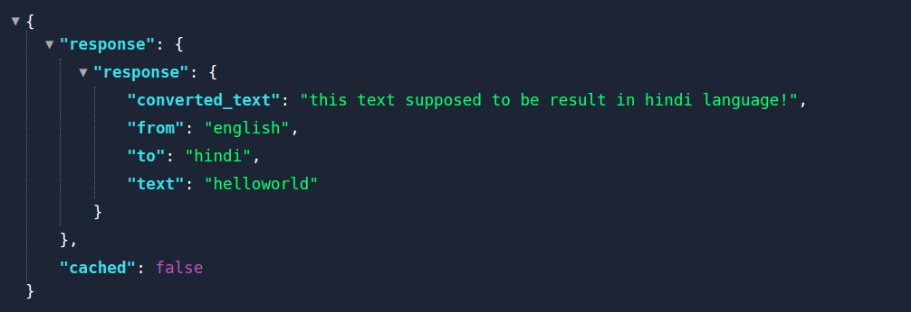
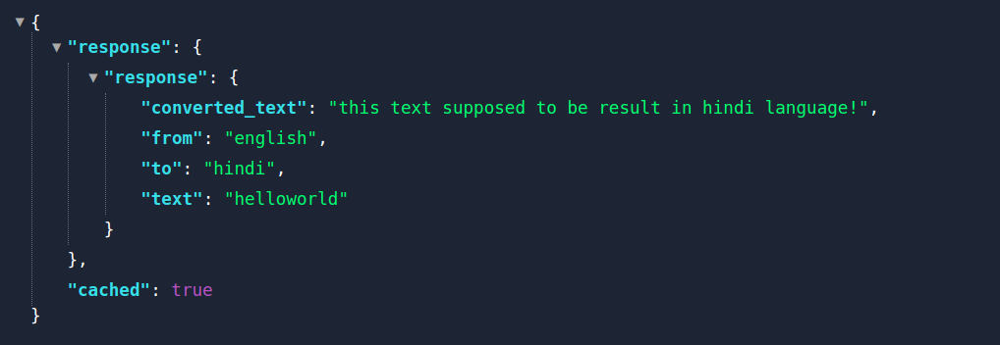

# translation caching

working flow:
 - client requests server to translate the text using a get request
  ``` /translate?text=helloworld&from=english&to=hindi```
  - server checks if that request has already cached or not, 
      - if cached,simply it responds with cached data
      - else 
        -  calls external/3rd party translation_service
        -  updates the cache
        - responds with result
  - if client again makes same request it simply responds with cached version


## how i did it?
   
   - i built an express server which will have a en endpoint ```/translate```
      -  we need to send query params to that endpoint to get the data
   - ```/translate``` will in turn calls an internal api (```/internal/translate```) which acts as third party service
   - i used plain objest {} as in memory storage to store cached results, but something like redis is preferable 
   
   
### caching && delivery mechanism

   - there are 2 middlewares 
     - one checks the cache and will set the response if cached data found
     - one calls the external  api if cache not found and set the response
     - finally main controller delivers the response to the client.

## quick demo
for the url  http://localhost:3000/translate?text=helloworld&from=english&to=hindi

  - response from the server for first time
    
  - sub sequent responses
      

    