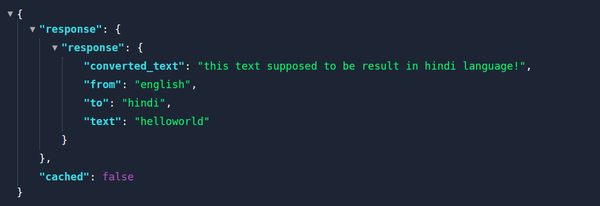
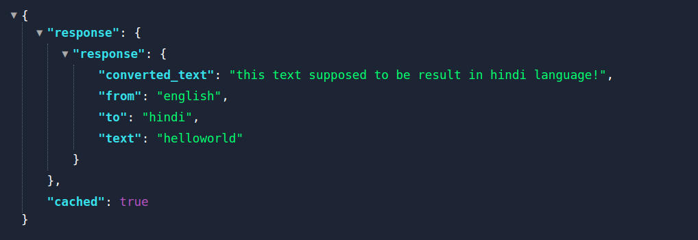

# Translation Caching (codeyoung nodejs intern assessment)

## Goal:
Develop a web server that exposes an API to translate a text.

## setup

```bash
 npm install
```
```bash
npm run dev
```
- after this open the browser/postman and make a get request to http://localhost:3000/translate
  - using query params as 
       - text
       - from (which is the language of text that being converted)
       - to (the language which we want text to be)

try this,
http://localhost:3000/translate?text=helloworld&from=english&to=hindi


## Tasks:
 - Create a web server with a RESTful API to translate a text from    one language to another.
 - The source and target language should be definable via the API.

***Note:*** For the translation, you can expose an API in your application which returns sample response as a translation text
and consider that API as a third-party provider.

### In addition,
 we want to cache translations, in order to avoid repeated hits to the translation API. The cache must be
persistent!
The server should have an extensible architecture. E.g. We may want to change our caching strategy or switch out our
translation service.
Bonus Tasks

## As a bonus task, 
 - implement smart pre-caching. This means we assume that if a user translates a text into Kannada,
 - he is likely to also translate the same text to Hindi. 
 - Therefore we want to not only request Kannada from the external service
 - but also other languages like Hindi, Tamil, etc. and store it in our cache.
 - The smart caching should not affect the response time of the translation API.

## Deliverables

- A functional web server and a short text explaining your design decisions. In addition, the text should contain how you
evaluated your results and ideas for further improvement (feel free to add mockups if required).

## quick demo
for the url  http://localhost:3000/translate?text=helloworld&from=english&to=hindi

  - response from the server for first time
    
  - sub sequent responses
      

    
    